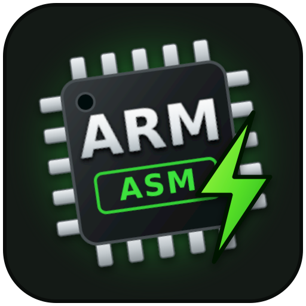

<table width="100%">
  <tr width="100%">
    <td align="left" valign="middle">
      
    </td>
    <td align="center" valign="middle">
    <h3>Assembler - the DNA of Computers</h3>
    </td>
    <td align="right" valign="middle">
      
    </td>
  </tr>
</table>

<h1 align="center">ARM Assembler Toolbox</h1>

<p align="center">
  ARM plugin for assembler code compilation, linking, size reporting, local execution, and remote build and run on ARM devices directly from Visual Studio Code.
</p>

<p align="center">
  
  
  
  
  
</p>

ARM Assembler Toolbox is a lightweight Visual Studio Code extension for writing, building and running ARM assembly (`.s`, `.S`, `.asm`) programs with the GNU toolchain.

It provides a minimal, fast workflow similar to PlatformIO, but focused on **pure assembler development** — locally on your workstation, or straight on an ARM board such as a **Raspberry Pi 5** reached over SSH.

<p align="center">
  
</p>

## Features

- 🔨 Assemble `.s` → `.o`
- 🔗 Link `.o` → executable (`ld` or the `gcc` driver, with optional `-nostartfiles`)
- 📊 Display section sizes (`size`), optionally followed by an ELF report (`readelf`)
- ▶ Run the program locally on Linux — natively on ARM hosts, or through QEMU user-mode emulation on x86
- 🌐 Upload, build and run on a remote ARM device over SSH, with the terminal output streamed back
- 🧹 Clean the remote working directory in one step, with a confirmation that names the path
- 🔐 Password kept in the encrypted VS Code secret storage, with SSH host key confirmation
- 🎓 Laboratory mode for shared computers: the device lives in the VS Code session only
- 🎨 ARM assembly syntax highlighting (AArch64 and AArch32)
- ❗ Clickable assembler errors (Problems panel integration), local **and** remote
- 📌 Status bar buttons and a sidebar with the current toolchain and device state

### 📁 Supported Files

- ARM assembly source files with extensions: `.s`, `.S`, `.asm`

## Requirements

What you need depends on where you build and run. Editing and syntax highlighting need nothing at
all, and the remote workflow needs no ARM toolchain on your own computer — it uses the one already
installed on the device.

---

### 🖥️ What works on which platform

| Your computer | Edit & highlight | Build locally | Run locally | Build & run on the device |
|---------------|:----------------:|---------------|-------------|---------------------------|
| Linux on ARM (Raspberry Pi, ARM64 workstation) | ✓ | ✓ native toolchain | ✓ runs natively | ✓ |
| Linux on x86_64 | ✓ | ✓ cross toolchain | ✓ QEMU user-mode | ✓ |
| macOS (Intel or Apple Silicon) | ✓ | ✓ GNU cross toolchain | ✗ — use the device | ✓ |
| Windows | ✓ | ✓ Arm GNU Toolchain | ✗ — use WSL or the device | ✓ |

> **Running a program locally is a Linux-only feature.** It uses QEMU *user-mode* emulation
> (`qemu-aarch64` / `qemu-arm`), which only exists on Linux hosts: the QEMU builds for macOS and
> Windows provide full-machine emulation (`qemu-system-…`) instead and cannot execute a Linux ARM
> binary directly. On macOS and Windows, build locally if you like and **run on the remote device** —
> or, on Windows, install the toolchain inside WSL and use VS Code's WSL window.

---

### 🧰 ARM Toolchain

Needed for **local** builds only. The tools must be installed and reachable from your system `PATH`
(or pointed at with absolute paths in the settings):

| Tool | Used for | Required |
|------|----------|----------|
| `as` | assembling `.s` files | yes |
| `gcc` | linking, and assembling `.S` files through the C preprocessor | when **Link With** is `gcc`, or for `.S` sources |
| `ld` | linking | when **Link With** is `ld` |
| `size` | section sizes after a successful build | yes |
| `readelf` | ELF headers, sections and symbols | only when **Run readelf After Size** is on |
| `qemu-aarch64` / `qemu-arm` | running the binary on a non-ARM host | Linux only, for local runs |

`as`, `ld`, `size` and `readelf` all come from **binutils**, so one package covers them.

On an **ARM Linux host** these are the plain, unprefixed tools. Everywhere else they come from a
cross toolchain and carry a prefix such as `aarch64-linux-gnu-`, which the extension adds
automatically — see **Toolchain Prefix** if yours is named differently.

#### Linux (Ubuntu / Debian) on x86_64, 64-bit ARM target

```bash
sudo apt update
sudo apt install binutils-aarch64-linux-gnu gcc-aarch64-linux-gnu qemu-user
```

For a 32-bit ARM target:

```bash
sudo apt install binutils-arm-linux-gnueabihf gcc-arm-linux-gnueabihf qemu-user
```

#### Linux (Ubuntu / Debian) running on the ARM device itself

```bash
sudo apt update
sudo apt install binutils gcc
```

No emulator and no toolchain prefix are needed here: the machine already speaks ARM.

#### Linux (Arch)

```bash
sudo pacman -S aarch64-linux-gnu-binutils aarch64-linux-gnu-gcc qemu-emulators-full
```

`qemu-emulators-full` is the package that carries the user-mode emulators; `qemu-full` alone does not.

#### macOS (Homebrew)

```bash
brew tap messense/macos-cross-toolchains
brew install aarch64-unknown-linux-gnu
```

Then point the extension at that toolchain:

```json
"arm-asm-builder.toolchainPrefix": "aarch64-unknown-linux-gnu-"
```

> Two things to know on macOS. The assembler shipped with Xcode produces Mach-O objects and rejects
> the ELF-oriented directives used here, so a GNU cross toolchain is required even on Apple Silicon.
> And there is no QEMU user-mode on macOS, so a locally built binary cannot be started locally —
> run it on the remote device instead. Installing the toolchain is therefore optional: with the
> remote workflow alone, macOS needs nothing installed at all.

#### Windows

1. Install the **Arm GNU Toolchain**, `AArch64 GNU/Linux target` (`aarch64-none-linux-gnu`), from
   [developer.arm.com](https://developer.arm.com/downloads/-/arm-gnu-toolchain-downloads), and let the
   installer add it to your `PATH`.
2. Tell the extension about its prefix, which differs from the Linux default:

```json
"arm-asm-builder.toolchainPrefix": "aarch64-none-linux-gnu-"
```

Local *running* is not available on Windows. Either use the remote device, or install the toolchain
inside **WSL** (`sudo apt install binutils-aarch64-linux-gnu gcc-aarch64-linux-gnu qemu-user`) and
open the project in a VS Code WSL window, where the extension behaves exactly as it does on Linux.

---

### 🔐 SSH client

**Nothing to install, on any platform.** The extension speaks SSH and SFTP itself through the bundled
`ssh2` library, so OpenSSH, PuTTY, Pageant or an `ssh-agent` are neither needed nor used. Passwords are
the only supported authentication method.

---

### 🖥️ Visual Studio Code

- Visual Studio Code version **1.110.0 or newer**
- This extension must be installed and enabled

---

### 🌐 Remote ARM Device (for remote build and run)

To build and run on a device such as a Raspberry Pi 5, you will need:

- The device reachable over the network, with the SSH server enabled (`sudo raspi-config` → *Interface Options* → *SSH*)
- A user account with a password — password authentication must be allowed by the SSH server
  (`PasswordAuthentication yes`, the default on Raspberry Pi OS); SSH keys are not supported
- The **SFTP subsystem** enabled in `sshd_config`, which is the default. Sources are uploaded over
  SFTP, so a server with `Subsystem sftp` commented out will connect but fail to upload
- `binutils` and `gcc` installed on the device:

  ```bash
  sudo apt update
  sudo apt install binutils gcc
  ```

  `binutils` covers `as`, `ld`, `size` and `readelf`; `gcc` is needed for linking against the C
  library and for `.S` sources. The device builds its own architecture, so no cross toolchain and no
  **Remote Toolchain Prefix** are involved
- A POSIX shell with the usual core utilities (`mkdir`, `ls`, `find`, `rm`, `chmod`, `printf`,
  `uname`), which every Raspberry Pi OS and Debian install has
- No graphical environment is required — only the command line output is used

Configure the connection with:

```
ARM: Configure Remote Device
```

which asks, in this order, for **IP address / host name**, **port**, **user name**, **password** and
**working directory**, then opens the settings page so the saved values are visible straight away.

The wizard is **all or nothing**: nothing is written until the last answer is in. Pressing
`Escape` at any prompt — including the password — leaves the previously configured device
exactly as it was, rather than leaving a new address paired with the old password.

Where those answers end up:

| Value | Stored in |
|-------|-----------|
| Host, port, user name, working directory | Extension settings, **User** scope |
| Password | Encrypted VS Code secret storage, never in `settings.json` |

If the same key is also set in the workspace (`.vscode/settings.json`), that copy is rewritten with
the new value as well. Otherwise the workspace value would keep overriding the User scope and the
Settings editor would disagree with what the prompts just accepted.

#### Editing the device in the settings

The wizard is not the only way in: host, port, user name and password can be edited directly in the
Settings editor, and every command opens its own SSH connection, so the next build or run already
uses the new values.

The stored password follows along. Passwords are kept in the secret storage under the device they
belong to (`user@host:port`), so changing the address, the port or the user name would otherwise
leave the password behind and cause a new password prompt. Instead, the extension notices the edit
and moves the stored password to the device the settings now describe — useful when a Raspberry Pi
just got a new DHCP address. If the new device already has a password of its own, that one is kept.
Should the two devices need different passwords, run **ARM: Set Remote Password** after the change.

Typing a password into `arm-asm-builder.remote.password` is also noticed: the extension offers to
move it into the encrypted secret storage and clear the clear-text setting. Choosing **Keep in
Settings** silences the offer for good.

---

#### Cleaning up the device

Builds accumulate on the device: every uploaded source, object file and binary stays in the remote
working directory unless **Keep Files on Device** is off. To wipe them in one step, run:

```
ARM: Clean Remote Working Directory
```

It connects, resolves the working directory (expanding `~`), and asks for confirmation showing the
absolute path, the device and how many entries would go — nothing is deleted until you confirm.
Hidden files and sub-directories are removed as well; the folder itself is kept.

Because the working directory is free text, `/`, the user's home directory and the usual system
directories (`/etc`, `/usr`, `/var`, `/tmp` and friends) are refused outright, before any prompt.

---

### 🎓 Laboratory Mode

```json
"arm-asm-builder.remote.laboratoryMode": true
```

For a classroom where every student works with a different device on a shared computer, and the
address of the previous student is easy to inherit by accident. With this flag on:

| | Laboratory mode | Normal use |
|---|---|---|
| Host, port and user name | Memory only, gone at the next VS Code start | `settings.json` |
| Password | Memory only, gone at the next VS Code start | Encrypted secret storage |
| Remembered SSH host keys | Forgotten at every start | Remembered |
| Working directory, toolchain, build flags | Stored as usual | Stored as usual |

The device is all or nothing: every start — and the moment the flag is switched on — clears
`remote.host`, `remote.port`, `remote.username` and `remote.password` from the settings and deletes
any password left in the secret storage, so the session begins on a clean slate and nothing about the
device outlives it. Host keys are dropped as well, because the same address is usually a different
machine in the next session and a remembered fingerprint would only raise a false alarm.

A device cannot be preset for the room this way: everything is entered per session, through
**ARM: Configure Remote Device**, which asks for all four values in one pass.

The setting has machine scope: it belongs to the computer, and a workspace cannot switch it off.
Students configure their device with **ARM: Configure Remote Device** — in this mode the wizard does
not open the Settings editor afterwards, because there is nothing there to show. The sidebar marks
the session with a **Laboratory mode** badge and reports the password as *this session only*.

Each VS Code window keeps its own session values, and switching the flag back off starts from the
settings again.

On the first connection the SSH host key fingerprint is shown for confirmation and then remembered.

---

### ⚙️ Optional Configuration

If the ARM toolchain is not available in your system `PATH`, you can configure explicit paths in settings:

```json
{
  "arm-asm-builder.assemblerPath": "/path/to/aarch64-linux-gnu-as",
  "arm-asm-builder.linkerPath": "/path/to/aarch64-linux-gnu-ld",
  "arm-asm-builder.gccPath": "/path/to/aarch64-linux-gnu-gcc",
  "arm-asm-builder.sizePath": "/path/to/aarch64-linux-gnu-size",
  "arm-asm-builder.readelfPath": "/path/to/aarch64-linux-gnu-readelf"
}
```

or using settings as described below.

---

## Extension Settings

This extension contributes the following settings under the `arm-asm-builder` namespace.

You can configure them via:

- **Settings UI** → search for `ARM ASM Builder`
- or directly in `settings.json`

---

### ⚙️ Available Settings

#### 🎓 Laboratory Mode

```json
"arm-asm-builder.remote.laboratoryMode": false
```
Keeps the remote device in the VS Code session only, for shared laboratory computers. Listed first
in the Settings editor as well, because it decides whether every other device value below is stored
at all. See [Laboratory Mode](#-laboratory-mode).

---

#### 🔧 Toolchain

```json
"arm-asm-builder.architecture": "aarch64"
```
Target architecture, `aarch64` (Raspberry Pi 5 with a 64-bit OS) or `arm32`. Drives the default toolchain prefix and the default emulator.

```json
"arm-asm-builder.toolchainPrefix": ""
```
Prefix prepended to `as`, `ld`, `gcc`, `size` and `readelf`, for example `aarch64-linux-gnu-`.
Empty means automatic: no prefix on an ARM host, the matching cross prefix elsewhere.

```json
"arm-asm-builder.assemblerPath": "as"
"arm-asm-builder.linkerPath": "ld"
"arm-asm-builder.gccPath": "gcc"
"arm-asm-builder.sizePath": "size"
"arm-asm-builder.readelfPath": "readelf"
```
Tool names or absolute paths. An absolute path is used as it is, without the prefix.

```json
"arm-asm-builder.useReadelf": false
"arm-asm-builder.readelfFlags": ["-W", "-h", "-s", "-S"]
```
Runs `readelf` on the linked binary right after `size`, locally and on the remote device, and writes its
report to the output channel. Disabled by default. The default flags print the ELF header (`-h`), the
symbol table (`-s`) and the section headers (`-S`) in wide format (`-W`). A missing or failing `readelf`
is only reported as a warning and never fails the build.

---

#### 🧠 Build Configuration

```json
"arm-asm-builder.linkWith": "gcc"
```
Link stage tool:
- `gcc` – the C library stays reachable, so your assembly can call `printf`
- `ld` – freestanding binary that has to use raw syscalls

```json
"arm-asm-builder.useNoStartFiles": true
```
Links with `-nostartfiles`. Recommended for pure assembly programs that define `_start` instead of `main`.

```json
"arm-asm-builder.entrySymbol": "_start"
```
Entry symbol passed to the linker.

```json
"arm-asm-builder.assemblerFlags": ["-g"]
"arm-asm-builder.linkerFlags": []
```
Extra flags, for example `-mcpu=cortex-a76` or `-static`.

```json
"arm-asm-builder.outputDirectory": "build"
```
Directory where build artifacts are stored (`.o`, `.elf`).

---

#### ▶ Local Run

```json
"arm-asm-builder.run.useEmulator": "auto"
```
`auto` runs natively on an ARM host and through QEMU elsewhere; `always` and `never` force the choice.

```json
"arm-asm-builder.run.emulatorPath": ""
```
QEMU user-mode emulator. Empty means `qemu-aarch64` or `qemu-arm` according to the architecture.

```json
"arm-asm-builder.run.emulatorLibraryPath": ""
```
Sysroot passed to QEMU via `-L`, needed for dynamically linked binaries, for example `/usr/aarch64-linux-gnu`.

```json
"arm-asm-builder.run.arguments": []
```
Command line arguments for your program, used locally and remotely.

```json
"arm-asm-builder.run.useIntegratedTerminal": false
```
Run in a VS Code terminal instead of the output channel. Use it for programs that read standard input.

---

#### 🌐 Remote Device

```json
"arm-asm-builder.remote.host": ""
"arm-asm-builder.remote.port": 22
"arm-asm-builder.remote.username": "pi"
```
Address, SSH port and user name of the ARM device.

```json
"arm-asm-builder.remote.password": ""
```
Optional, and it takes precedence over the stored password. **Anything put here is stored in clear text**,
so the extension offers to move it into the secret storage. Prefer **ARM: Set Remote Password**, which
writes to the encrypted secret storage in the first place.

```json
"arm-asm-builder.remote.workingDirectory": "~/arm-asm-builder"
```
Directory on the device where sources are uploaded and built. Created automatically.

```json
"arm-asm-builder.remote.toolchainPrefix": ""
```
Toolchain prefix on the device. Normally empty — a Raspberry Pi builds ARM code natively.

```json
"arm-asm-builder.remote.uploadExtraFiles": []
```
Additional workspace-relative files uploaded next to the current source, for example include files.

```json
"arm-asm-builder.remote.keepFiles": true
```
Keep uploaded sources and binaries on the device after a run.

```json
"arm-asm-builder.remote.connectTimeout": 15000
"arm-asm-builder.remote.strictHostKeyChecking": true
```
Handshake timeout in milliseconds, and host key confirmation on first connection.

---

### 📝 Example Configuration

```json
{
  "arm-asm-builder.architecture": "aarch64",
  "arm-asm-builder.toolchainPrefix": "aarch64-linux-gnu-",
  "arm-asm-builder.linkWith": "ld",
  "arm-asm-builder.useNoStartFiles": true,
  "arm-asm-builder.entrySymbol": "_start",
  "arm-asm-builder.assemblerFlags": ["-g"],
  "arm-asm-builder.outputDirectory": "build",
  "arm-asm-builder.run.useEmulator": "auto",
  "arm-asm-builder.remote.host": "192.168.1.50",
  "arm-asm-builder.remote.port": 22,
  "arm-asm-builder.remote.username": "pi",
  "arm-asm-builder.remote.workingDirectory": "~/arm-asm-builder"
}
```

---

### 💡 Notes

- All tool paths can be either:
  - command names (if available in `PATH`)
  - or absolute paths
- Settings can be defined:
  - globally (user settings)
  - per project (`.vscode/settings.json`)
- Changes take effect immediately (no restart required)

## Commands

| Command | Description |
|---------|-------------|
| `ARM: Build Current .s File` | Assemble and link the active file on this machine |
| `ARM: Build and Run Locally` | Build, then execute natively or under QEMU |
| `ARM: Upload and Build on Remote Device` | Copy the source to the device and build it there |
| `ARM: Upload, Build and Run on Remote Device` | Copy, build and execute on the device, streaming the output back |
| `ARM: Stop Running Program` | Terminate the running local process or remote session |
| `ARM: Configure Remote Device` | Ask for IP, port, user name and password |
| `ARM: Set Remote Password` | Store the SSH password in the encrypted secret storage |
| `ARM: Clear Stored Remote Password` | Remove the stored password, and optionally the clear-text one in the settings |
| `ARM: Test Remote Connection` | Log in, report `uname -a` and the assembler version |
| `ARM: Clean Remote Working Directory` | Delete everything in the remote working directory, after confirmation |
| `ARM: Open Settings` | Open the settings of this extension |

## Example

Below is a minimal AArch64 program that prints a line of text using Linux syscalls, so it links
with either `ld` or `gcc`. It runs on a **Raspberry Pi 5** with a 64-bit OS and, locally, under QEMU.

Create a file named `hello.s`:

```asm
// hello.s - AArch64 Linux

        .equ SYS_WRITE, 64
        .equ SYS_EXIT,  93
        .equ STDOUT,    1

        .section .rodata
message:
        .ascii  "Hello from ARM assembly!\n"
        .equ    message_len, . - message

        .text
        .global _start

_start:
        mov     x0, #STDOUT             // fd
        adrp    x1, message             // page address of the string
        add     x1, x1, :lo12:message   // exact address of the string
        mov     x2, #message_len        // byte count
        mov     x8, #SYS_WRITE          // write(2)
        svc     #0

        mov     x0, #0                  // exit status
        mov     x8, #SYS_EXIT           // exit(2)
        svc     #0
```

### How to run locally

1. Open `hello.s` in Visual Studio Code
2. Click **ARM Build** in the status bar or run:
   ```text
   ARM: Build Current .s File
   ```
3. Execute it:
   ```text
   ARM: Build and Run Locally
   ```

The output channel shows the invoked commands, the section sizes and the program output:

```text
> aarch64-linux-gnu-as -g -o build/hello.o hello.s
> aarch64-linux-gnu-ld -e _start build/hello.o -o build/hello.elf

SIZE:
   text	   data	    bss	    dec	    hex	filename
     61	      0	      0	     61	     3d	build/hello.elf

BUILD OK -> build/hello.elf

RUN:
> qemu-aarch64 build/hello.elf
Hello from ARM assembly!

PROGRAM FINISHED (exit code 0)
```

### How to run on a Raspberry Pi 5

1. Run `ARM: Configure Remote Device` and enter the IP address, port, user name and password
2. Confirm the host key fingerprint shown on the first connection
3. Run:
   ```text
   ARM: Upload, Build and Run on Remote Device
   ```

The source is copied over SFTP into the remote working directory, assembled and linked with the
toolchain of the device, and executed there. Everything the program writes to standard output and
standard error appears in the **ARM ASM Builder** output channel.

### Notes

- The example uses `write(2)` and `exit(2)` directly, so no C library is needed.
- Set `arm-asm-builder.linkWith` to `gcc` if you want to call C library functions such as `printf`.
- Dynamically linked binaries executed under QEMU need `arm-asm-builder.run.emulatorLibraryPath`,
  for example `/usr/aarch64-linux-gnu`, or link with `-static`.

## Known Issues

- Linking errors (e.g. an undefined label) do not guide you to the source file when clicking an error in the output console, because `ld` reports section offsets rather than source positions.
- Programs that read from standard input need `arm-asm-builder.run.useIntegratedTerminal` for local runs; remote runs are non-interactive.
- Only the active file is assembled. Multi-file projects need a build system of their own; extra files can still be shipped to the device with `arm-asm-builder.remote.uploadExtraFiles`.
- The `.s` extension is shared with other assembler extensions. If both this and an AVR extension are installed, pick the language mode per file in the status bar.
- Running a program locally works on Linux only, natively on ARM or through QEMU user-mode emulation. On macOS and Windows, build locally if you wish but run on the remote device — or use WSL on Windows.
- The remote connection authenticates with a password only; SSH keys and agents are not supported.

## Release Notes

### 0.1.0

Initial release:

- Assembling and linking `.s`, `.S` and `.asm` sources with the GNU toolchain, `ld` or the `gcc` driver
- Section sizes after every build, with an optional `readelf` report
- Local execution: native on ARM Linux, QEMU user-mode on x86 Linux
- Upload, build and run on a remote ARM device over SSH, with the output streamed back
- Clean-up of the remote working directory, with confirmation
- Device configuration applied all at once: address, port, user name and password are never half-applied
- Laboratory mode for shared computers, keeping the device in the VS Code session only
- Password kept in the encrypted secret storage, SSH host key confirmed on first use
- ARM syntax highlighting for AArch64 and AArch32, clickable diagnostics, sidebar and status bar

## About the project:


The MultiASM project has been co-funded by the European Union. Views and opinions expressed are however those of the author or authors only and do not necessarily reflect those of the European Union or the Foundation for the Development of the Education System. Neither the European Union nor the entity providing the grant can be held responsible for them.

[MultiASM website](https://multiasm.eu)

KA220-HED – Cooperation partnerships in higher education

Project ID: 2023-1-PL01-KA220-HED-000152401

Project implementation period: from 2023.12.01 to 2026.11.30 (36m)

**Enjoy!**
